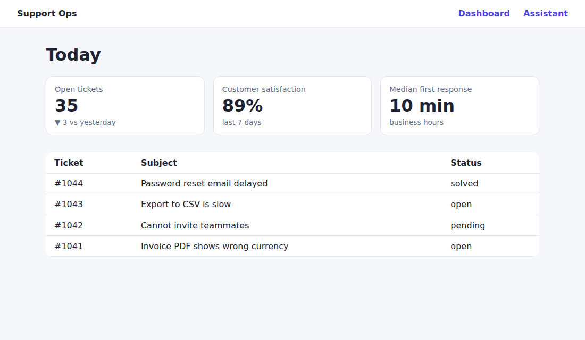
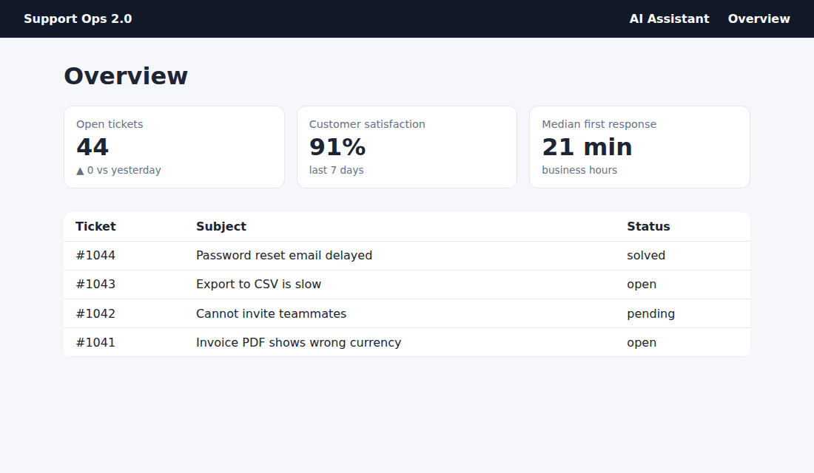
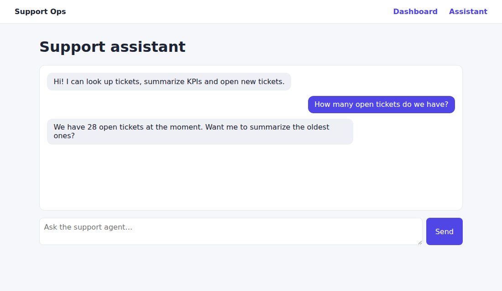
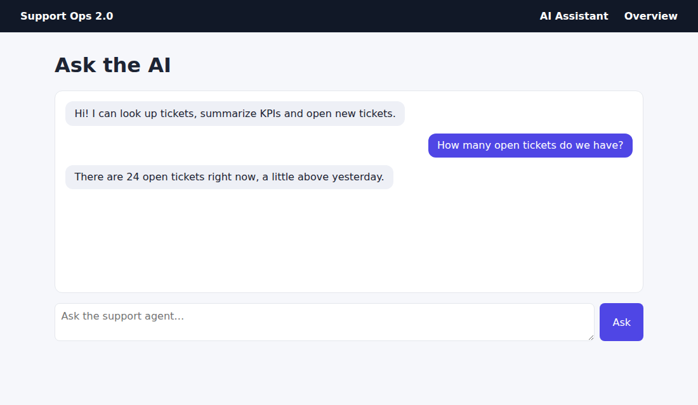

# Example: Support Ops (dashboard + AI assistant)

A small but realistic app to watch planwright work: a support dashboard whose numbers change on every load, and an AI assistant whose answers are worded differently every time. It shows the full lifecycle: plan → replay → heal after a redesign → fail on a real outage.

| v1 | v2 redesign |
|---|---|
|  |  |
|  |  |

```
examples/agentic-dashboard/
  app/server.ts            the app (no dependencies; the assistant is a scripted fake, no API key needed)
  features/*.feature       the scenarios
  features/*.plan.json     committed plans, what planwright replays
  planwright.config.ts     starts the app in beforeAll, picks the LLM
  offline-brain.ts         offline stand-in for the LLM (used when ANTHROPIC_API_KEY is unset)
  bench.ts                 first run vs cached run vs redesign benchmark (npm run example:bench)
  results/                 committed benchmark output and screenshots
```

## Run it

From the repo root:

```bash
npm install
npm run example                          # build planwright, then `planwright run` in this folder
```

Or from this folder, after `npm run build` at the root: `npx planwright run`.

With `ANTHROPIC_API_KEY` set, the config uses the real default provider (Claude). Without it, it uses [`offline-brain.ts`](offline-brain.ts), a scripted stand-in that only knows this app. It sees exactly what a real model sees (step goal, element list, page text, what it already did), so planwright runs the same code either way. The committed plans were generated with it (`"generatedBy": {"provider": "scripted"}`). Run `npx planwright plan` with a key to regenerate them with Claude.

## The tour

### 1. Replay: no LLM

```bash
npx planwright run --ci
```

```
features/assistant.feature › Ask about the backlog
  ✓ Given I open the assistant replayed 131ms
  ✓ When I ask the assistant "How many open tickets do we have?" replayed 1171ms
  ✓ Then the assistant replies with a number of open tickets replayed 37ms
  ✓ And the reply sounds like a helpful support teammate judged 345ms
...
3 passed · LLM: 1 call(s) · 3.0s · exit 0
```

Every step replays from the plan. The one LLM call is the **tone** assertion: "sounds like a helpful support teammate" can't be checked structurally, so it is judged on every run. The factual assertions are compiled into stateless checks:

| Step | Stored check | Why it survives changing data |
|---|---|---|
| `the assistant replies with a number of open tickets` | text of `.msg.assistant` matches `(?=.*\d)(?=.*\bopen\b)` | any count, any wording |
| `I see the open tickets KPI with a number` | text of the KPI card matches `Open tickets \d+` | the value changes every load |
| `I see customer satisfaction as a percentage` | text matches `\d+%` | |
| `the recent tickets table lists at least one ticket` | count of `#recent-tickets tbody tr` ≥ 1 | |
| `the recent tickets table shows "login page timing out"` | table text matches `login page timing out` | the literal came from the step itself |

### First run vs cached run

Measured on this example (13 steps, 3 scenarios) with `npm run example:bench`. Full output: [`results/benchmark.md`](results/benchmark.md) ([JSON](results/benchmark.json)).

| Run | Steps using the LLM | LLM calls | Input tokens | Browser time |
|---|---|---|---|---|
| First run (no plans) | 13 of 13 | 25 | ~63,900 | 8.4s |
| **Cached run** | **1 of 13** | **1** | **~1,700** | **3.3s** |
| After the v2 redesign (heal) | 8 of 13 | 17 | ~43,600 | 46.4s |
| Cached run on v2 | 1 of 13 | 1 | ~1,700 | 3.3s |

Where the numbers come from:

- **Tokens** are estimated from the actual requests (≈4 characters per token, ≈1.2k tokens per 1280×720 screenshot). Every planning turn sends the element list, page text and a screenshot, so a turn costs ~2.5k input tokens. The offline brain reports these estimates. With a real provider, the usage the API returns is what's reported.
- **Browser time** leaves out model latency, because the offline brain answers instantly. With a real model, add roughly 25 × per-call latency to the first run (minutes) and 1 × to the second (seconds).
- **Cost at Claude Opus 5.5 rates ($4 / $20 per MTok):** the first run is about $0.25 of input plus output that depends on reasoning length. A cached run is under $0.02, almost all of it the tone judge. Drop or rephrase that one semantic `Then` and a cached run makes zero LLM calls.
- Most of the cached run's 3.3s is the app itself: the assistant takes 0.5–1.5s to answer, twice.

After that, every run costs what the second run costs, until the UI changes. Then only the changed steps pay planning prices again (section 2: 7 healed steps, 17 calls).

### Run it with real Claude, through your Claude Code login

No API key needed: `claudeCli()` drives the logged-in `claude` CLI.

```bash
cd examples/agentic-dashboard
PLANWRIGHT_LLM=claude-cli npx planwright run               # replay the committed plans (PLANWRIGHT_MODEL=opus to pick a model)
PLANWRIGHT_LLM=claude-cli npx planwright run --no-cache    # plan every step from scratch; plan files are left untouched
PLANWRIGHT_CLI_LOG=./cli-log PLANWRIGHT_LLM=claude-cli npx planwright run --no-cache   # also log every CLI call to ./cli-log
```

Measured with `PLANWRIGHT_LLM=claude-cli npm run example:bench` ([`results/benchmark-claude-cli.md`](results/benchmark-claude-cli.md)):

| Run | LLM calls | Input tokens | Wall time |
|---|---|---|---|
| First run (no plans) | 25 | ~209,000 | 106s |
| **Cached run** | **2** | **~7,000** | **10s** |
| After the v2 redesign (heal) | 18 | ~132,000 | 112s |
| Cached run on v2 | 2 | ~7,000 | 11s |

Input tokens include prompt-cache reads and writes. Real Claude found weak spots that the offline brain never hit, all fixed in planwright:
- **Value-only targets:** Claude pointed checks at the element holding the value (the KPI number, the chat bubble). Those targets now fall back to position and stable class names instead of being dropped.
- **Waiting on result text:** Claude waited for the reply's exact text, which pinned a changing value. Waits on page text are now rejected.
- **Over-fitted patterns:** Claude copied one phrasing of a generated reply into a pattern (`created #\d+`). Patterns may now only use words from the assertion, match case-insensitively, and on a heal the failed pattern is fed back so the next one generalizes.
- **Vanishing indicators:** "Thinking…" disappeared while the model was still deciding to wait for it. The hidden-wait is now recorded from the captured element, so replays still wait.
- **Premature `done`:** a model claimed success on the blank start page, or on a 404 it reached by guessing `/dashboard`. `done` on a blank page is refused; on an HTTP error page it is refused once with a hint to use the app's navigation (a step that is about the error page can still finish there).

### Judge tone locally with Laya (zero LLM calls)

The one LLM call left in a cached run is the tone judge. To hand it to [Laya](https://github.com/receptron/laya), the open-source Jev-compatible decision model, which runs locally:

```bash
npm install -D @receptron/laya               # from the repo root; -D is required inside this repo (it's an optional peer of planwright)
cd examples/agentic-dashboard
PLANWRIGHT_JUDGE=laya npx planwright run     # first use downloads ~1.7 GB of weights from Hugging Face
```

```
  ✓ And the reply sounds like a helpful support teammate judged …
3 passed · LLM: no calls · …
```

The example sends Laya only the chat transcript ([`judge-state.ts`](judge-state.ts)) with `threshold: 0.5`. That setup won the calibration on real hardware ([`results/laya-calibration.md`](results/laya-calibration.md)): helpful replies scored 0.85–0.91, rude and off-topic ones 0.05–0.07. With the whole page as state, nav and headings blurred the verdicts to 0.3–0.9 for everything. To calibrate your own assertions, run `npm run example:laya-calibrate` and adapt it.

The step's evidence shows the calibrated probability, e.g. `P(holds) = 0.912 (threshold 0.7, …)`. `PLANWRIGHT_JUDGE=laya npm run example:bench` writes `results/benchmark-laya.md` for comparison.

### 2. Ship a redesign: healing

`APP_UI=v2` ships "Support Ops 2.0": nav links renamed (Assistant → AI Assistant, Dashboard → Overview), the Send button becomes **Ask** with a new test id, the message box gets a new label, and the KPI test ids change.

```bash
APP_UI=v2 npx planwright run --ci
```

```
  ✓ Given I open the assistant HEALED (LLM)
  ✓ When I ask the assistant "How many open tickets do we have?" HEALED (LLM)
  ...
  HEALED features/assistant.feature › Ask about the backlog
           When I ask the assistant "How many open tickets do we have?"
           why: Target button "Send" not found; tried testid="send", role=button[name="Send"], text="Send".
           - fill textbox "Message" with "How many open tickets do we have?"
           - click button "Send"
           - wait for text "Thinking…" to be hidden
           + fill textbox "Message" with "How many open tickets do we have?"
           + click button "Ask"
           + wait for text "Thinking…" to be hidden
...
3 passed · exit 2
```

Things to notice:

- **Only broken steps are re-planned.** The message box kept its placeholder, so its ranked locators still found it with no LLM. Only the click on "Send" drifted, and the agent continued from there.
- **Assertions heal too.** The KPI checks failed on the old test ids. The judge confirmed the KPIs are still there, then the checks were re-compiled against the new ids.
- **Exit 2** in CI: everything passed, but the plans changed. Review `planwright-results/drift-report.md` and the `*.plan.json` diff, then commit. The next v2 run replays with no LLM calls.

`git checkout features/*.plan.json` resets the tour.

### 3. Break the backend: infra, not drift

```bash
APP_SLOW=1 npx planwright run --ci
```

```
  ✗ When I ask the assistant "How many open tickets do we have?"
      Known-slow wait timed out: text "Thinking…" still visible after 20000ms.
...
1 passed, 2 failed · LLM: no calls · exit 3
```

The assistant never answers. Planwright recognizes a stuck "Thinking…" indicator as a slow backend, not a changed page. It doesn't re-plan, doesn't touch the plan, and exits 3.

### 4. Remove a feature: a real failure

Delete the Ask/Send button from `app/server.ts` and run again. The cached plan drifts, re-planning finds no way to send a message, the scenario **fails** (exit 1) and the old plan is kept. Healing never papers over a missing feature.

## What makes these scenarios plan well

- `When` steps are single intents ("I ask the assistant …"), not click paths.
- `Then` steps describe shape, not values: "a number of open tickets", never "37 open tickets".
- Tone and helpfulness are separate `Then`s, so only they pay for an LLM call per run.
- The mutating scenario is tagged `@mutating`, so a read-only production smoke run can skip it: `-t "not @mutating"`.

Full guide: [`skills/write-gherkin-scenarios/SKILL.md`](../../skills/write-gherkin-scenarios/SKILL.md).
